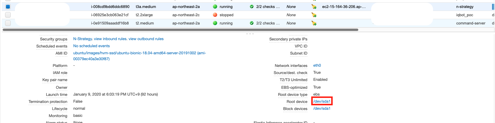
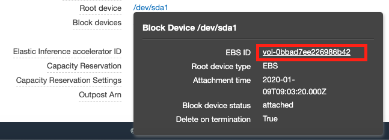
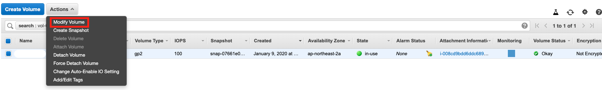
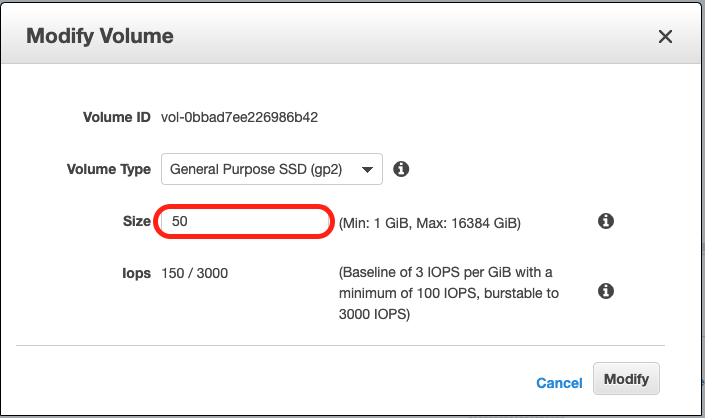

가끔 운영중인 EC2의 디스크가 부족해 디스크 용량을 늘려야 할 경우가 생긴다.

디스크 용량을 늘리는 방법은 생각보다 손쉬웠는데 EC2 를 stop 시키지 않아도 되었다.

그 방법을 정리해 보았다.

## AWS 콘솔 설정

1. AWS console에 접속 > EC2 서비스 이동
  



2. EC2 인스턴스를 선택후 `detail` 탭의 `Root device` 를 선택. EBS_ID 링크로 EBS 콘솔 화면으로 이동



3. 해당되는 EBS 선택된 상태로 ‘Modify Volume’ 을 선택



4. 원하는 디스크 사이즈 입력하고 `Modify` 버튼 클릭



5. 물리적 디스크 용량은 늘어나지만 여기가 끝이 아님.

## 파티션 설정

ssh 로 들어가서 df로 확인해보면 하드디스크 용량은 아직 늘지 않았다.

```shell script
$ df -hT
Filesystem     Type      Size  Used Avail Use% Mounted on
udev           devtmpfs  1.9G     0  1.9G   0% /dev
tmpfs          tmpfs     390M  772K  389M   1% /run
/dev/nvme0n1p1 ext4       15G   13G  1.8G  89% /
tmpfs          tmpfs     2.0G     0  2.0G   0% /dev/shm
tmpfs          tmpfs     5.0M     0  5.0M   0% /run/lock
tmpfs          tmpfs     2.0G     0  2.0G   0% /sys/fs/cgroup
/dev/loop0     squashfs   90M   90M     0 100% /snap/core/7713
/dev/loop1     squashfs   18M   18M     0 100% /snap/amazon-ssm-agent/1480
/dev/loop2     squashfs   90M   90M     0 100% /snap/core/8268
tmpfs          tmpfs     390M     0  390M   0% /run/user/1000
```

파티션 설정이 되어 있지 않아 늘어난 볼륨이 반영 되어 있지 않기 때문이다. 

```shell script
$ lsblk
NAME        MAJ:MIN RM  SIZE RO TYPE MOUNTPOINT
loop0         7:0    0   89M  1 loop /snap/core/7713
loop1         7:1    0   18M  1 loop /snap/amazon-ssm-agent/1480
loop2         7:2    0 89.1M  1 loop /snap/core/8268
nvme0n1     259:0    0   50G  0 disk
└─nvme0n1p1 259:1    0   15G  0 part /
```

위의 명령어로 확인해보면 50G 로 늘어난 것은 보이지만 실제 `/`(루트)에는 15G 밖에 할당되어 있지 않음

파티션 설정을 해보자.

## Linux 파티션 크기 조정

```shell script
$ sudo growpart /dev/nvme0n1 1
CHANGED: partition=1 start=2048 old: size=31455199 end=31457247 new: size=104855519,end=104857567
```

파티션이 적용되어 있는지 확인해보면

```shell script
$ lsblk
NAME        MAJ:MIN RM  SIZE RO TYPE MOUNTPOINT
loop0         7:0    0   89M  1 loop /snap/core/7713
loop1         7:1    0   18M  1 loop /snap/amazon-ssm-agent/1480
loop2         7:2    0 89.1M  1 loop /snap/core/8268
nvme0n1     259:0    0   50G  0 disk
└─nvme0n1p1 259:1    0   50G  0 part /
```

늘어난 만큼 파티션 크기가 반영되었다.

그러나 리눅스는 파일 시스템 확장까지 해야 실제 하드디스크를 이용할 수 있다.

## ex4 파일 시스템 확장

파일시스템의 종류에 따라 파일시스템 변경방식이 다르다.

현재 ex4 파일시스템을 `/` 에 쓰고 있으므로 다음 명령어로 확장해보자.

```shell script
$ sudo resize2fs /dev/nvme0n1p1
resize2fs 1.44.1 (24-Mar-2018)
Filesystem at /dev/nvme0n1p1 is mounted on /; on-line resizing required
old_desc_blocks = 2, new_desc_blocks = 7
The filesystem on /dev/nvme0n1p1 is now 13106939 (4k) blocks long.
```

실제로 파일 시스템이 확장 되었는지 확인해보자.

```shell script
$ df -hT
Filesystem     Type      Size  Used Avail Use% Mounted on
udev           devtmpfs  1.9G     0  1.9G   0% /dev
tmpfs          tmpfs     390M  772K  389M   1% /run
/dev/nvme0n1p1 ext4       49G   13G   36G  27% /
tmpfs          tmpfs     2.0G     0  2.0G   0% /dev/shm
tmpfs          tmpfs     5.0M     0  5.0M   0% /run/lock
tmpfs          tmpfs     2.0G     0  2.0G   0% /sys/fs/cgroup
/dev/loop0     squashfs   90M   90M     0 100% /snap/core/7713
/dev/loop1     squashfs   18M   18M     0 100% /snap/amazon-ssm-agent/1480
/dev/loop2     squashfs   90M   90M     0 100% /snap/core/8268
tmpfs          tmpfs     390M     0  390M   0% /run/user/1000
```

루트가 확장되어 50G 모두 반영되었다.

## 참고

- https://docs.aws.amazon.com/ko_kr/AWSEC2/latest/UserGuide/recognize-expanded-volume-linux.html
