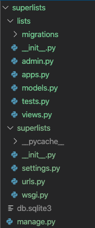
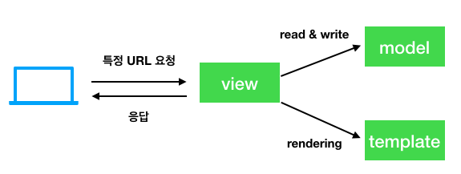

## Intro

본격적인 To-Do 웹 에플리케이션 개발을 위해 단위 테스트를 만들어본다.

## 첫 Django 애플리케이션과 첫 단위 테스트(예제 : 03-01)

- Django 는 1개 프로젝트에 n개 app으록 구성되어 있다.
- 이것은 다른 프로젝트에서도 동일한 앱을 사용가능하도록 app 단위로 재사용을 가능하게 하기 위한 것이다.
- 앱은 코드를 구조화하기위한 좋은 수단이다.

### 작업 목록 앱을 만들어 보자.

```sh
$ python manage.py startapp lists

```

실행하면 superlists/superlists 와 동일 위치에 spuerlists/lists 라는 폴더가 생성된다.



## 단위 테스트는 무엇이고, 기능 테스트와 어떤 차이가 있을까?

| 종류  |  단위 테스트   |  기능 테스트   |
| --- | :-------: | :-------: |
| 관점  | 프로그래머 관점  |  사용자 관점   |
| 목표  | 애플리케이션 내부 | 애플리케이션 외부 |
| 레이어 |   하위 레벨   |   상위 레벨   |

### 테스트 작업 순서

1. 기능 테스트 작성 : 사용자 관점의 새로운 기능성 정의
2. 기능 테스트 실패 - 하위단의 어떤 기능을 작성해야 통과할지 고민/설계
  2-1. 단위 테스트 작성 : 기능테스트에서의 고민은 테스트로 작성
  2-2. 단위 테스트 실패 : 테스트를 통과할 정도로 최소한의 코드 작성. 과정 2-1/2-2를 하나의 기능 테스트 완성될 때까지 반복
3. 기능 테스트 재실행하여 통과하는지 확인. 실패시 과정 2로 돌아가서 다시 작성. 통과시 한가지 기능 완성

즉 상위단(기능테스트) 를 먼저 작성후에 그 하위단(단위 테스트)을 잘게 쪼게서 테스트 함을 알수 있다.
번거로워 보일 수 있으나, 실질적인 설계와 이후에 검증할수 있는 자동화된 툴까지 만들어지기 때문에 합리적인 프로세스인거 같다.

## Django에서의 단위 테스트(예제 : 03-02)

### TDD 주기

선 실패 -> 테스트를 통과할 코드 작성 -> 후 통과 -> 새 테스트 코드 작성 -> 선 실패..(계속 반복)

### django.test.TestCase 클래스

Django는 기본 TestCase class를 확장한 django.test.TestCase 클래스를 기본 단위 테스트로 사용하도록 권하고 있다.
django 프로젝트에 맞는 여러 확장 기능들이 있다.
그 중에 manage.py 에서 test 커맨드로 전체 testcase를 실행하는 기능이 포함되어 있다.
고의적인 실패 테스트를 작성하여 이를 확인해 보자.

[lists/tests.py](https://github.com/PilhwanKim/books/blob/master/test_driven_development_with_python/ch03/03-02/superlists/lists/tests.py)

```sh
$ python manage.py test

Creating test database for alias 'default'...
System check identified no issues (0 silenced).
F
======================================================================
FAIL: test_bad_maths (lists.tests.SmokeTest)
----------------------------------------------------------------------
Traceback (most recent call last):
  File "workspace/superlists/lists/tests.py", line 7, in test_bad_maths
    self.assertEqual(1 + 1, 3)
AssertionError: 2 != 3

----------------------------------------------------------------------
Ran 1 test in 0.001s

FAILED (failures=1)
Destroying test database for alias 'default'...
```

## Django의 MVC, URL, 뷰 함수(예제 : 03-03)

Django는 **대체로** MVC(Model-View-Cotroller) 패턴을 따름

이 MVC 패턴을 차용하여 Django는

| MVC패턴       |  Django  |
| ----------- | :------: |
| Model(Data) |  Model   |
| View        | Template |
| Controller  |   View   |

라고 표현하여 MTV(model-template-view)패턴이라고 명명함

### HTTP 요청 Django 의 처리 흐름



저기 중에 http client - view 사이에서 일어나는 일을 좀더 자세히 설명하면 이렇다.

1. 특정 URL에 대한 HTTP 요청 받음
2. 특정 규칙을 이용해서 해당 요청에 어떤 뷰 함수를 실행할 지 결정
3. 뷰 기능 요청을 처리하고 HTTP 응답을 반환

따라서 우리가 테스트 할 2가지

1. URL의 루트("/")를 해석해서 특정 뷰 기능에 매칭시킬 수 있는가?
2. 이 뷰 기능이 특정 HTML을 반환하게 해서 기능 테스트를 통과하는가?

[첫 번째 테스트 코드](https://github.com/PilhwanKim/books/blob/master/test_driven_development_with_python/ch03/03-03/superlists/lists/tests.py)

```sh
$ python manage.py test
System check identified no issues (0 silenced).
E
======================================================================
ERROR: lists.tests (unittest.loader._FailedTest)
----------------------------------------------------------------------
ImportError: Failed to import test module: lists.tests
Traceback (most recent call last):
  File "/Users/pilhwankim/.pyenv/versions/3.7.1/lib/python3.7/unittest/loader.py", line 434, in _find_test_path
    module = self._get_module_from_name(name)
  File "/Users/pilhwankim/.pyenv/versions/3.7.1/lib/python3.7/unittest/loader.py", line 375, in _get_module_from_name
    __import__(name)
  File "/Users/pilhwankim/Github/books/test_driven_development_with_python/ch03_Testing_a_Simple_Home_Page_with_Unit_Tests/03-03/superlists/lists/tests.py", line 3, in <module>
    from lists.views import home_page
ImportError: cannot import name 'home_page' from 'lists.views' (/Users/pilhwankim/Github/books/test_driven_development_with_python/ch03_Testing_a_Simple_Home_Page_with_Unit_Tests/03-03/superlists/lists/views.py)


----------------------------------------------------------------------
Ran 1 test in 0.000s

FAILED (errors=1)
```

예상하던 대로 에러가 발생한다.
대략 에러의 내용은 veiws 의 home_page 라는 존재하지 않는 것을 임포트 하려고 했기 때문에 발생했다.
예측된 실패이고 TDD 관점으로는 거쳐가야 할 첫 과정이다.

## 마침내 실질적인 애플리케이션을 작성한다(예제 : 03-04)

실패 테스트를 해결해 보자. 한번에 하나씩! 일단 import 에러를 해결한다.

[view 구현 코드](https://github.com/PilhwanKim/books/blob/master/test_driven_development_with_python/ch03/03-04/superlists/lists/views.py)

너무 단순하고 허무한 코드이기 한데, 저자의 의도는 이런거 같다.

***한 번에 한 가지의 당면한 문제를 해결해라!***

다음과 같이 구현하고 다시 테스트를 돌려보면 다른 에러가 발생한다.

```sh
python manage.py test
Creating test database for alias 'default'...
System check identified no issues (0 silenced).
E
======================================================================
ERROR: test_root_url_resolves_to_home_page_view (lists.tests.HomePageTest)
----------------------------------------------------------------------
Traceback (most recent call last):
  File "/Users/pilhwankim/Github/books/test_driven_development_with_python/ch03_Testing_a_Simple_Home_Page_with_Unit_Tests/03-04/superlists/lists/tests.py", line 8, in test_root_url_resolves_to_home_page_view
    found = resolve('/')
  File "/Users/pilhwankim/.pyenv/versions/tdd-with-python-env/lib/python3.7/site-packages/django/urls/base.py", line 24, in resolve
    return get_resolver(urlconf).resolve(path)
  File "/Users/pilhwankim/.pyenv/versions/tdd-with-python-env/lib/python3.7/site-packages/django/urls/resolvers.py", line 567, in resolve
    raise Resolver404({'tried': tried, 'path': new_path})
django.urls.exceptions.Resolver404: {'tried': [[<URLResolver <URLPattern list> (admin:admin) 'admin/'>]], 'path': ''}

----------------------------------------------------------------------
Ran 1 test in 0.004s

FAILED (errors=1)
Destroying test database for alias 'default'...
```

## URL과 뷰 함수 맵핑(예제 : 03-05)

- Django 는 urls.py 에서 URL과 view 를 매핑할지 정의
- superlists(project root)/superlists/urls.py - 전체 사이트 대상으로 하는 메인 urls.py

참고 사항) 2판 기준 책이 django 1.7 기준이다. 굳이 예전버전을 쓸 필요는 없으므로 최신의 2.2 버전으로 최대한 예제를 따라 진행한다.
크게 바뀐 내용은 3가지 정도 요약됨

1. django.conf.urls.url 로 매핑하던 내용이 django.urls.path 로 표준적인 설정이 바뀜(이전것도 사용가능하나. django 에서는 path를 기본으로 함)
2. 따라서 url pattern 입력이 정규식 표현에서 path convert 방식으로 바뀜
3. 문자열로 view 경로 설정 방식 제외. 직접 view 를 import 함

책의 내용과 비슷하게 아래와 같이 urls.py 를 변경해 진행해보면

```py
from django.contrib import admin
from django.urls import path
from lists import views as home_views

urlpatterns = [
    # path('admin/', admin.site.urls),
    path('', home_views.home_page, name='home'),
]
```

```sh
$ python manage.py test
Creating test database for alias 'default'...
Destroying test database for alias 'default'...
Traceback (most recent call last):
(...생략...)
  File "/test_driven_development_with_python/ch03_Testing_a_Simple_Home_Page_with_Unit_Tests/03-05/superlists/superlists/urls.py", line 22, in <module>
    path('/', lists.views.home_page, name='home'),
  File "~/.pyenv/versions/tdd-with-python-env/lib/python3.7/site-packages/django/urls/conf.py", line 73, in _path
    raise TypeError('view must be a callable or a list/tuple in the case of include().')
TypeError: view must be a callable or a list/tuple in the case of include().
```

urls.py 에 view와 url 매핑은 했으나,아직 lists.views.home_page 가 None 값으로 아직 미구현 되어서 나타나는 에러이다.

다시 lists/views.py 로 돌아가서 실제 view 를 함수로 구현해보자.

[view 구현 코드](https://github.com/PilhwanKim/books/blob/master/test_driven_development_with_python/ch03/03-05/superlists/lists/views.py)

테스트를 실행해보면

```sh
python manage.py test
Creating test database for alias 'default'...
System check identified no issues (0 silenced).
.
----------------------------------------------------------------------
Ran 1 test in 0.001s

OK
Destroying test database for alias 'default'...
```

첫 테스트가 성공했다! 사이트 루트("/") 요청을 django view 까지 연결하는 것이 성공했다는 의미이다.

## 뷰를 위한 단위 테스트(예제 : 03-06)

- 이제 사이트 루트 요청에 실제 HTML 응답값을 반환하는 내용도 추가해야 함
- 위의 내용을 검증하는 테스트 코드 추가가 먼저

[tests 구현 코드](https://github.com/PilhwanKim/books/blob/master/test_driven_development_with_python/ch03/03-06/superlists/lists/tests.py)

추가된 테스트는 요약하면 response body 텍스트가

```html
<html>
<title>To-Do lists</title>
</html>
```

내용으로 오는지 검증하는 내용이다.

```sh
python manage.py test
======================================================================
ERROR: test_home_page_returns_correct_html (lists.tests.HomePageTest)
----------------------------------------------------------------------
Traceback (most recent call last):
  File "/Users/pilhwankim/Github/books/test_driven_development_with_python/ch03_Testing_a_Simple_Home_Page_with_Unit_Tests/03-06/superlists/lists/tests.py", line 15, in test_home_page_returns_correct_html
    response = home_page(request)
TypeError: home_page() takes 0 positional arguments but 1 was given

----------------------------------------------------------------------
Ran 2 tests in 0.001s

FAILED (errors=1)
```

의도적으로 테스트를 돌려보면 실패한다. 이제 구현해야 한다.

### 단위 테스트-코드 주기

1. 터미널에서 단위 테스트를 실행하여 어떻게 실패하는지 확인한다.
2. 편집기 상에서 현재 실패 테스트를 수정하기 위한 **최소한의 코드**를 변경한다.

코드 품질을 높이고자 한다면 코드 변경은 최소화 한다. 즉 이 케이스에서는

```sh
home_page() takes 0 positional arguments but 1 was given
```

라고 했기 때문에 home_page 함수에 argument를 1개 추가하는 **최소한의 코드**를 변경하고 다시 테스트 해야한다.

1. 코드 변경(request 추가)

```py
def home_page(request):
    pass
```

2. 테스트

```sh
======================================================================
ERROR: test_home_page_returns_correct_html (lists.tests.HomePageTest)
----------------------------------------------------------------------
Traceback (most recent call last):
  File "/superlists/lists/tests.py", line 16, in test_home_page_returns_correct_html
    self.assertTrue(response.content.startswith(b'<html>'))
AttributeError: 'NoneType' object has no attribute 'content'

----------------------------------------------------------------------
```

home_page 에 리턴값 없이 None 으로 오기 때문이다. 그래서 코드 변경은?

3. 코드 변경(return 에 django.http.HttpResponse 사용)

```py
from django.http import HttpResponse

def home_page(request):
    return HttpResponse()
```

4. 테스트

```sh
======================================================================
FAIL: test_home_page_returns_correct_html (lists.tests.HomePageTest)
----------------------------------------------------------------------
Traceback (most recent call last):
  File "/superlists/lists/tests.py", line 16, in test_home_page_returns_correct_html
    self.assertTrue(response.content.startswith(b'<html>'))
AssertionError: False is not true

----------------------------------------------------------------------
Ran 2 tests in 0.007s
```

리턴값 객체는 맞게 왔으나 contents 가 없기 때문이다. contents를 채울 코드 변경은?

5. 코드 변경(HttpResponse 에 html content 텍스트 넣기)

```python
from django.http import HttpResponse


def home_page(request):
    return HttpResponse('<html><title>To-Do lists</title></html>')
```

6. 테스트

```sh
python manage.py test
Creating test database for alias 'default'...
System check identified no issues (0 silenced).
..
----------------------------------------------------------------------
Ran 2 tests in 0.002s

OK
Destroying test database for alias 'default'...
```

드디어 하나의 단위 테스트가 완결되었다!

이전에 개발했었던 기능 테스트(functional_test.py)를 다시 실행해보자!

```sh
# shell을 2개 띄우고 한쪽에는 django 서버를 띄움 
$ python manage.py runserver

# 다른 한쪽에서 기능 테스트 실행
$ python functional_test.py
F
======================================================================
FAIL: test_can_start_a_list_and_retrieve_it_later (__main__.NewVisitorTest)
----------------------------------------------------------------------
Traceback (most recent call last):
  File "functional_test.py", line 21, in test_can_start_a_list_and_retrieve_it_later
    self.fail('Finish the test!')
AssertionError: Finish the test!

----------------------------------------------------------------------
Ran 1 test in 2.256s

FAILED (failures=1)
```

unittest 결과는 실패로 나오지만 self.fail()가 실행되어 asserionError 가 난 것이므로 이전 test 는 통과한 것이다.
첫번째 기능 테스트도 성공이다!

## 느낀점

이 장에서 저자가 독자들이 깨닫기 원하는 핵심적인 내용은 **단위 테스트-코드 주기** 와  **최소한의 코드 변경** 이 아닌가 싶다. 
사실 기능이나 코드 양으로 따지면 되게 적은 양인데 저렇게 까지 자주 테스트 해야하나? 라는 생각도 든다. 
하지만 여기서 이렇게 세밀한 스텝을 언급하는 이유는 아마도 TDD가 어떤 것인지 실제 경험해 보기 위함이라는 생각이 든다. 
한번에 한 가지씩! 한번에 아주 작은 스텝을 밟아나가기! 실제 TDD를 개발하는 방법이 이렇다는걸 잘 깨닫게 된 계기가 된 것 같다.
